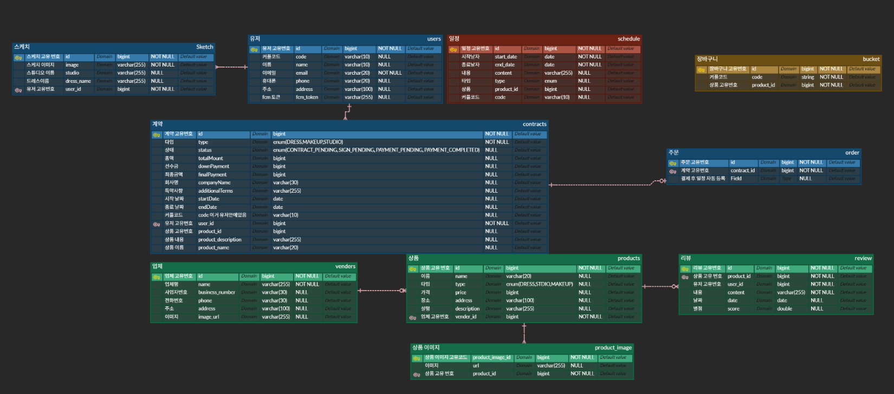
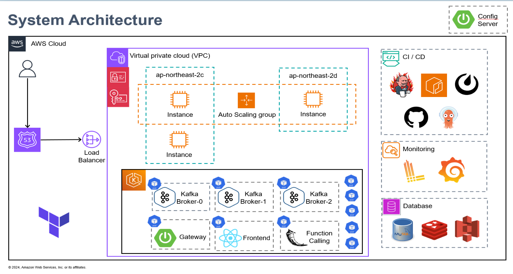
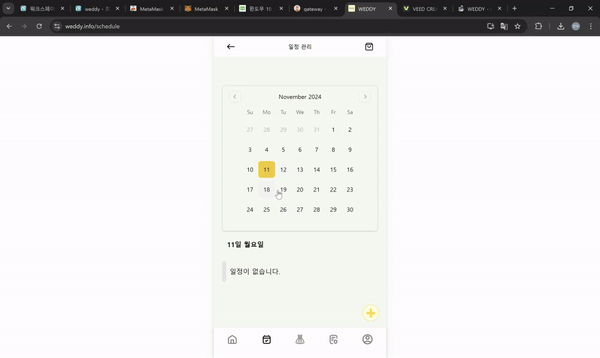
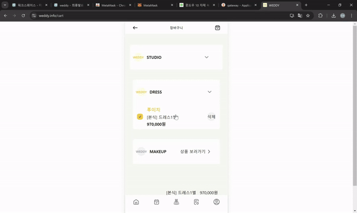
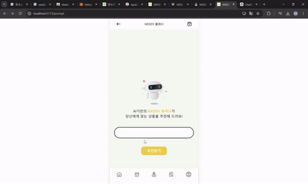
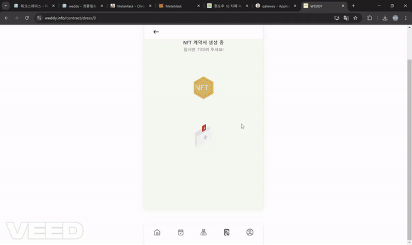
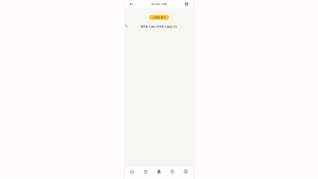

# 💻 Weddy 웨딩 플래너 🏄🏻‍♂️

## 프로젝트 소개 🌱
- 기간 : 2024.10.14 ~ 2024.11.18 💞️
- 팀명 : 스드메의 문단속
- 팀원 : 김시온, 안진우, 이병수 , 최승호, 이호영, 이채연

## 기능 소개🌱

1. 간편한 일정 관리 및 리마인드
- 결혼 준비 일정을 손쉽게 관리하며, 각종 예약과 중요한 이벤트를 잊지 않도록 푸시 알림을 통해 리마인드 가능

2. 안전한 계약 체결 및 관리
- NFT 기술을 활용하여 계약 내용을 디지털 자산으로 관리하여, 위변조 방지 및 계약 신뢰성 향상

3. AI 기반 맞춤형 상품 추천
- Function Calling 기능을 통해 사용자의 요청에 맞춘 상품을 자동 추천, 더 빠르고 정확한 선택이 가능.

4. 원스톱 웨딩 플래닝 서비스
- 예산 계획, 일정 조정, 서비스 추천 등 웨딩 준비의 모든 과정을 지원하여 번거로운 계획을 효율적으로 관리.

5. 다양한 상품 비교 및 조회
- 웨딩 관련 다양한 상품을 쉽게 비교하고 조회, 사용자가 필요에 맞는 상품을 신속하게 선택할 수 있도록 지원.

## UCC
[(Audio) 1115-2024_11_15-Topview.m4a](..%2F..%2F..%2F..%2FDownloads%2F%28Audio%29%201115-2024_11_15-Topview.m4a)
## WEDDY 팀원 소개

| **김시온(팀장) [Infra]**                                                                                    | **이호영** [FE]                                                     | **이채연** [FE]                                                 |
|--------------------------------------------------------------------------------------------------------|------------------------------------------------------------------|--------------------------------------------------------------|
|                                             |      |  |
| EKS ,Terraform 이용한 IaC,  Jenkins, ArgoCD, ECR , GitOps 를 이용한 CI/CD   Function calling 이용한 상품 추천 | 프론트 디자인 담당   FCM 알림 구현   API 통신 담당                         | API 통신 담당   NFT를 이용한 계약서 작성                            |
| **안진우 [BE]**                                                                                           | **이병수 [BE]**                                                     | **최승호 [BE]**                                                 |
|                                             |  |  |
| 3D 모델링 드레스 스케치  상품 API 구현   로그 모니터링                                                              | FCM 푸시알림 구현   카카오 간편 결제   계약서, 결제, 일정 서비스 구현               | 소셜 로그인(google)   security 구현   장바구니, user 서비스 구현       |

## 개발 환경 👀

    <h1>📚 기술 스택 & 버전 정보</h1>

### BackEnd

  

Java: 17
SpringBoot: 3.3.2
Spring Security: 3.3.2
JWT: 0.11.5
MySQL: mysql Ver 9.0.1
Redis: 3.3.2

### FrontEnd

Node.JS: 20.12.2
npm: 10.5.0
WebPack
REACT: 18.3.1
Zustand: 4.5.4
TailwindCSS: 3.4.8
Figma
DaisyUI: 4.12.10

### DevOps

### ETC

 
 
 

## ERD 🌐

## 아키텍쳐♟️

## [웨딩 업체 중개 플랫폼] 서비스
### 1. 일정관리

### 2. 온라인 NFT 계약

### 3. Function Calling 상품 추천

### 4. 상품 결제

### 5. 3D 모델링

